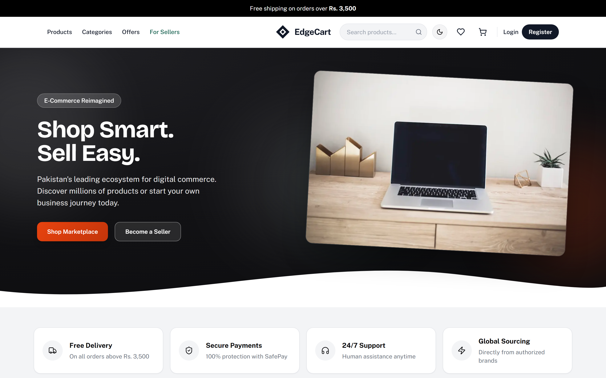
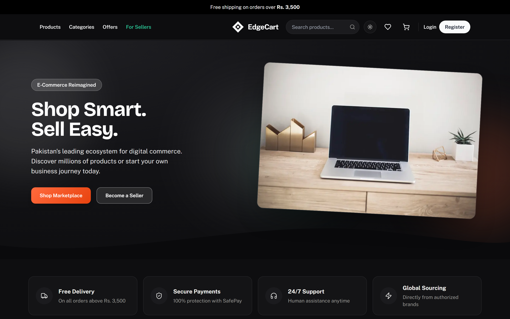
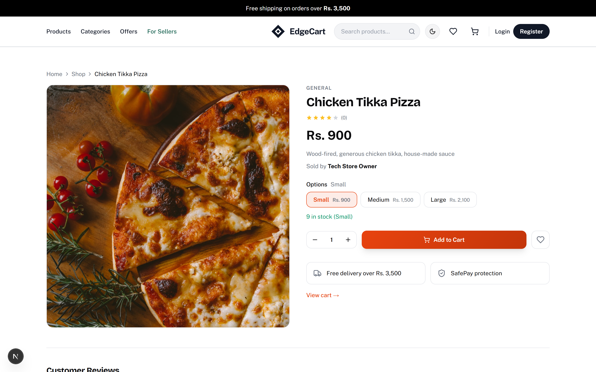
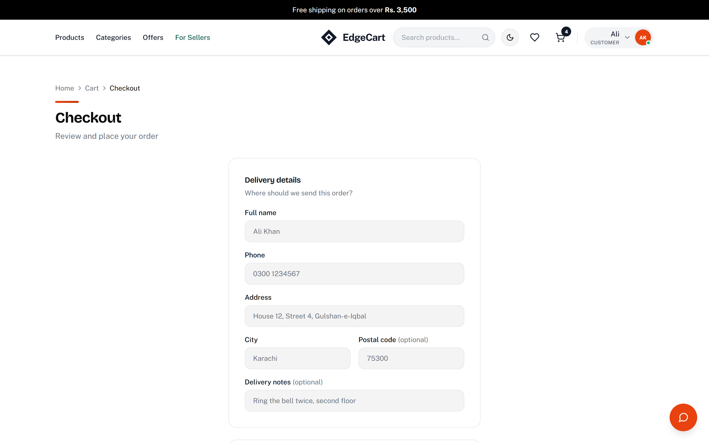
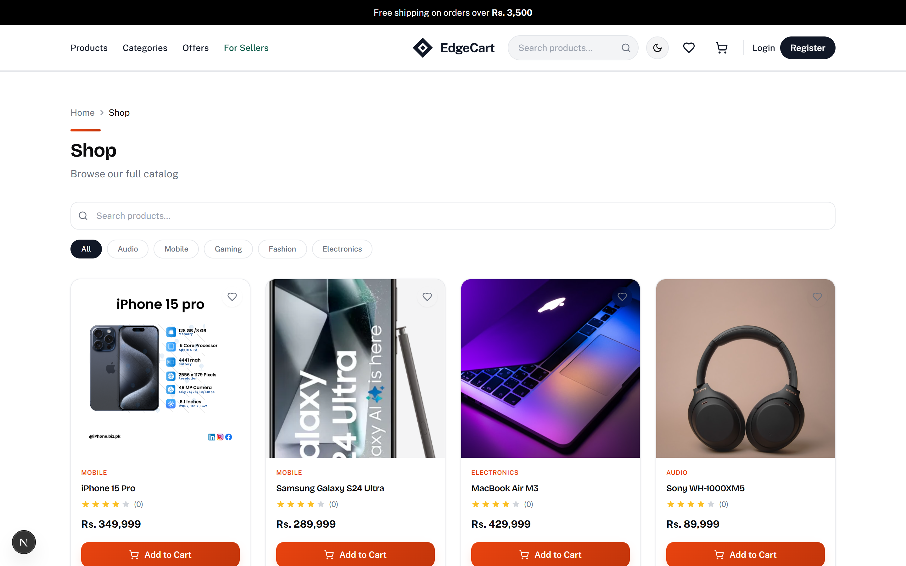
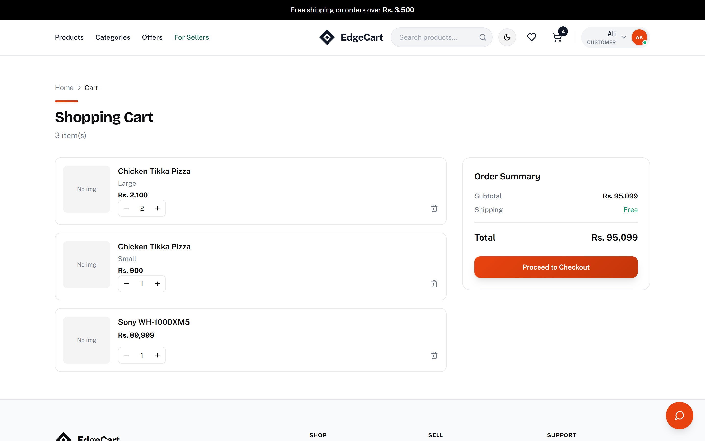
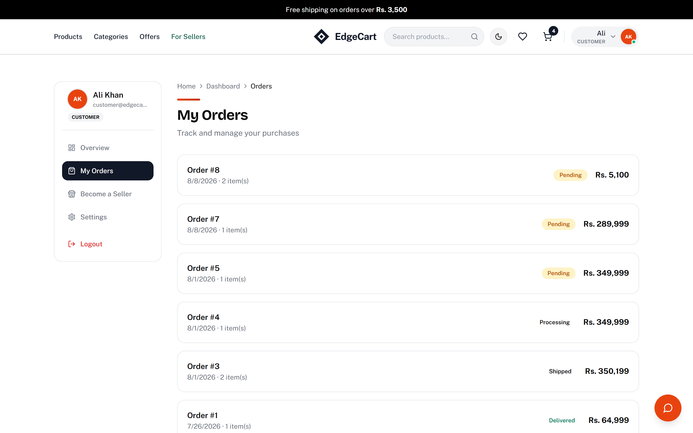
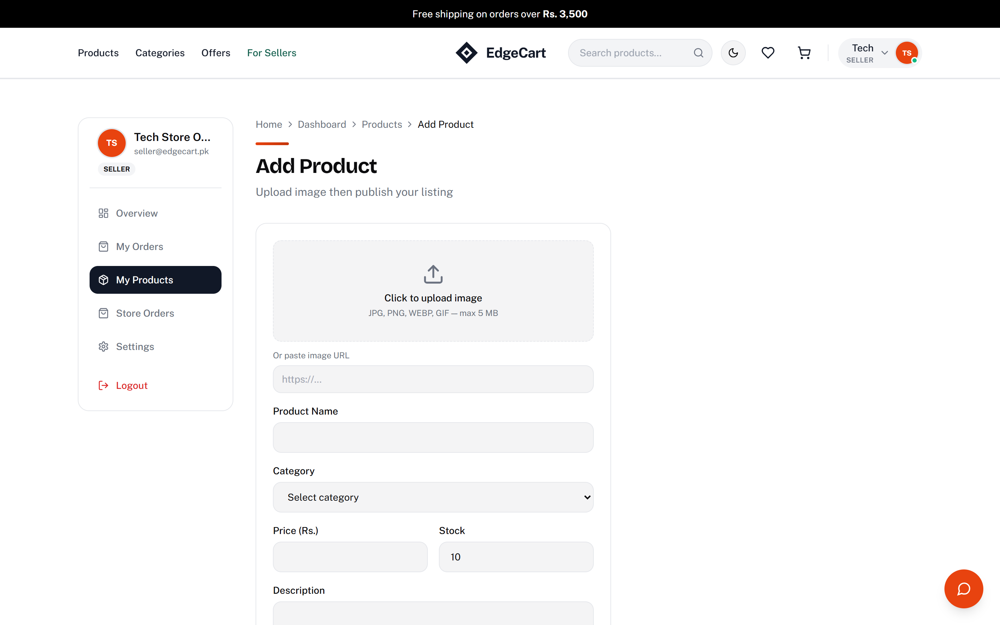
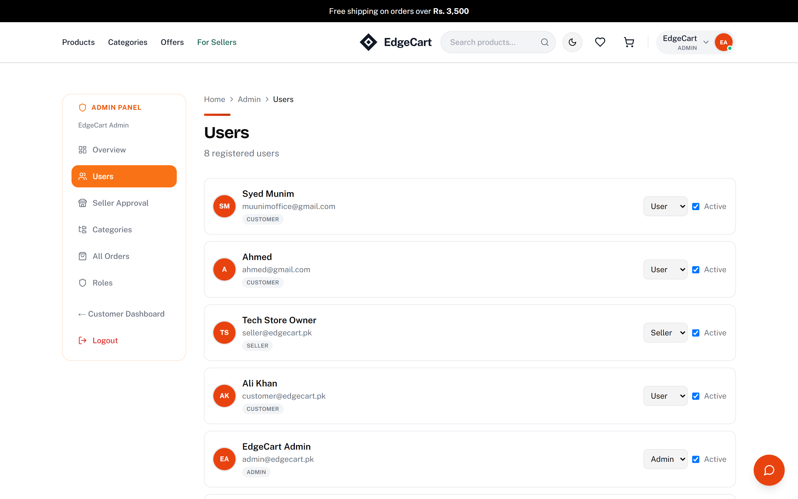

# EdgeCart

**A full-stack, multi-role e-commerce marketplace** built with ASP.NET Core 8 and Next.js 16 — customers shop, sellers list and fulfill products, and admins run the platform, all on one codebase with a real payment integration behind it.




---

## Live Demo

| | |
|---|---|
| 🛍️ **Storefront** | **https://edgecart-web.azurewebsites.net** |
| ⚙️ **API + Swagger** | **https://edgecart-api.azurewebsites.net/swagger** |

**Sign in as any role** — password `Password123` for all three:

| Role | Email | Try |
|---|---|---|
| Customer | `customer@edgecart.pk` | Browse → cart → Stripe checkout, or ask the [shopping assistant](docs/ai-assistant.md) in the corner |
| Seller | `seller@edgecart.pk` | List a product, view your orders |
| Admin | `admin@edgecart.pk` | Approve sellers, manage categories and users |

> **First request may take ~30 seconds.** The database runs on Azure SQL's serverless
> tier, which pauses when idle and needs a moment to resume. It's quick after that.

Payments run in **Stripe test mode** — use card `4242 4242 4242 4242`, any future
expiry and any CVC. No real charge is made.

---

## Overview

EdgeCart is a from-scratch e-commerce platform covering the parts of the domain that actually make it interesting to build: **stock-safe checkout**, **server-authoritative payments**, **role-based access for three distinct user types**, and a **clean, layered backend architecture** rather than a single monolithic API project.

It's built as a portfolio project — every feature below is implemented and working end-to-end, from a product page click all the way through a real Stripe test-mode charge landing in the database.

**Three roles, one platform:**
- 🛍️ **Customers** — browse, search, cart, checkout, track orders, leave reviews
- 🏪 **Sellers** — apply for a seller account, list products, fulfill orders, view their own sales
- 🛠️ **Admins** — approve sellers, manage users/roles/categories, oversee all orders

---

## Key Features

- **Authentication & security** — JWT bearer auth, BCrypt password hashing, role-based authorization policies (Admin/User/Seller), 4-digit OTP password reset flow with rate limiting
- **Product catalog** — categories, search, pagination, seller-owned product management with image upload
- **Cart & checkout** — server-side stock validation on every cart mutation, so you can never add or order more than what's in stock
- **Orders** — stock decrement and order creation wrapped in a single database transaction (no orphaned orders or double-decremented stock on failure)
- **Payments (Stripe)** — hosted Stripe Checkout session created server-side; the charge amount is always the server's order total, never a value the client can influence. Confirmed via both a signed Stripe **webhook** and a **confirm-on-return** check on the success page, plus a Cash-on-Delivery fallback
- **Shopping assistant** — a chat widget that answers real questions about the catalog, the customer's cart and their orders, with **two implementations behind one `IChatService` interface** and no change to the controller or the front end either way. The default is keyword-driven: it classifies the message, runs the matching EdgeCart service and formats the result — no API key, no per-message cost, works offline, and deliberately **read-only**, because a keyword match is a guess and a wrong guess must not write to someone's cart. Setting `Claude:ApiKey` swaps in the Claude-backed one, which handles free-form questions through **tool use**: the model never touches the database, it requests a tool and the API runs the service. Both scope every lookup to the caller's `userId` taken from the **JWT**, never from the conversation, so no prompt can reach another customer's data — [full walkthrough](docs/ai-assistant.md)
- **Uploads on Azure Blob Storage** — product and profile images go to Blob when `Storage:ConnectionString` is set and to local disk otherwise. Disk tied every image to one machine: publishing replaces the deployment folder and a second instance would not see what the first wrote
- **Reviews** — one review per user per product
- **Seller onboarding** — apply → admin approval workflow before a seller can list products
- **Admin panel** — user management (soft-delete/reactivate, never a hard delete), role management, category management, order oversight
- **Observability & reliability** — structured logging via **Serilog** (console + rolling file), a global exception handler returning consistent **RFC-7807 ProblemDetails** responses, and a `/health` endpoint

---

## Tech Stack

**Backend**

| | |
|---|---|
| Framework | ASP.NET Core 8 Web API |
| Data access | Entity Framework Core 8 + SQL Server |
| Auth | JWT Bearer, BCrypt.Net |
| Mapping | AutoMapper |
| Payments | Stripe.net |
| AI | Anthropic Claude API (tool use) |
| Logging | Serilog (console + file sinks) |
| API docs | Swashbuckle / Swagger |

**Frontend**

| | |
|---|---|
| Framework | Next.js 16 (App Router) |
| UI library | React 19 + TypeScript |
| State/data | Redux Toolkit + RTK Query |
| Styling | Tailwind CSS |
| Animation | Framer Motion |

---

## Screenshots

**Light and dark** — the theme follows the system preference on a first visit and is
remembered after that. Every colour is a CSS variable, so both themes come from one set of
components.

| | |
|---|---|
|  |  |

**Products sold in options** — each size carries its own price and stock, so the page shows a
"from" price until one is picked, and the stock line follows the selection.



**Checkout** — the delivery address is captured here and copied onto the order, so a later
profile edit cannot rewrite where a past order was sent.



<details>
<summary>More — catalogue, cart, orders, seller and admin</summary>

| | |
|---|---|
| Catalogue |  |
| Cart |  |
| Customer orders |  |
| Seller — new product |  |
| Admin — users |  |

</details>

---

## Architecture

The backend follows a **3-layer clean architecture** — each layer only knows about the one below it:

```
Controllers (API)  →  Service (business logic)  →  Repository (EF Core / data access)
```

- A **generic repository** (`IGenericRepository<T>`) plus a small **unit-of-work** abstraction (`IUnitOfWork`) keep data access consistent and let multi-step operations (like order creation + stock decrement + cart clearing) commit or roll back atomically.
- DTOs are mapped via **AutoMapper**, keeping domain entities out of the API surface.
- The frontend talks to the backend through a **BFF proxy** (`/bff/*` rewritten to the API by Next.js) instead of calling it directly, which avoids CORS entirely in the browser.

```
ECommerce/
├── ECommerce/          # Web API — controllers, Program.cs, middleware, startup seeding
├── Service/            # Business logic — services, DTOs, AutoMapper profiles
└── Repository/         # EF Core — entities, migrations, generic repository, unit of work

FrontEnd/
├── app/                 # Next.js App Router pages (storefront, dashboard, admin)
├── components/          # Reusable UI components
├── features/            # Redux slices (auth, cart, wishlist, theme)
└── lib/                 # RTK Query API layer, utilities, types
```

---

## Deployment

Both halves run on **Azure App Service (Linux)**, sharing one plan, with **Azure SQL
Database** on the serverless tier behind them.

```
edgecart-web  (Next.js, standalone build)  ──/bff/*──►  edgecart-api  (ASP.NET Core 8)
                                                              │
                                                              ▼
                                                   Azure SQL  (serverless)
```

A few decisions worth calling out:

- **No secrets in the repo.** Connection strings, the JWT signing key, SMTP and Stripe
  credentials live in App Service configuration. .NET reads environment variables last,
  so they override `appsettings.json` at runtime without the file ever holding a secret.
  Locally the same values come from `dotnet user-secrets`.
- **Uploads survive deploys.** They go to **Azure Blob Storage** (`Storage:ConnectionString`),
  so a redeploy, a restart or a second instance leaves them alone. Publishing replaces the
  deployment folder wholesale, so anything under `wwwroot` would be deleted on the next
  deploy. Without a blob connection string the app falls back to disk at
  `FileUpload:RootPath`, which Program.cs serves at `/uploads`.
- **Migrations run at startup**, after the host starts listening, so a slow database
  never delays the port binding.
- **The frontend is deployed as a Next.js standalone build** — a self-contained server
  with only the dependencies it actually uses, which keeps the upload at ~5 MB instead
  of shipping all of `node_modules`.

`NEXT_PUBLIC_*` values are baked into the client bundle at build time, so the frontend has
to be built with the settings it will run under:

```powershell
$env:BACKEND_API_URL  = "https://edgecart-api.azurewebsites.net"
$env:NEXT_PUBLIC_API_URL = "/bff"
npm run build
```

> Build this from **PowerShell or CMD, not Git Bash**. Git Bash rewrites arguments that look
> like Unix absolute paths, so `NEXT_PUBLIC_API_URL=/bff` is baked in as
> `C:/Program Files/Git/bff` and every API call from the browser resolves to a `file://` URL
> that cannot load. Verify with `grep -r "Program Files" .next/static/chunks/` — it should
> print nothing.

---

## Getting Started

### Prerequisites
- [.NET 8 SDK](https://dotnet.microsoft.com/download/dotnet/8.0)
- [Node.js 20+](https://nodejs.org/)
- SQL Server (LocalDB, Express, or full) running locally

### 1. Clone

```bash
git clone https://github.com/syedmunimshah/Ecommerece-Backend-Dotnet-and-Fronted-React.git
cd Ecommerece-Backend-Dotnet-and-Fronted-React
```

### 2. Backend setup

```bash
cd ECommerce/ECommerce
dotnet user-secrets init
dotnet user-secrets set "ConnectionStrings:ECommerce" "Server=YOUR_SERVER;Database=ECommerce;Trusted_Connection=True;TrustServerCertificate=True"
dotnet user-secrets set "Jwt:Key" "a-long-random-secret-at-least-32-characters"
dotnet user-secrets set "Stripe:SecretKey" "sk_test_..."   # optional — get a free key at dashboard.stripe.com
dotnet user-secrets set "Claude:ApiKey" "sk-ant-..."       # optional — upgrades the assistant to the model-backed one
dotnet run
```

The API applies EF Core migrations and seeds demo data automatically on first run. It's available at `http://localhost:5241`, with interactive API docs at `http://localhost:5241/swagger`.

> Don't have a Stripe key handy? Leave it unset — checkout still works via **Cash on Delivery**.
> Same for the Claude key: leave it unset and everything runs, the chat endpoint just returns 503.

### 3. Frontend setup

```bash
cd FrontEnd
npm install
cp .env.local.example .env.local
npm run dev
```

Open `http://localhost:3000`.

> The frontend proxies `/bff` to whatever `BACKEND_API_URL` points at, which defaults to
> `http://localhost:5241` — the port the `dotnet run` profiles use. Launching the API from
> Visual Studio under **IIS Express** instead puts it on a different port, and every request
> through the proxy answers 500 until the two agree.

### Demo accounts

The backend seeds these on first run so you can try every role immediately:

| Role | Email | Password |
|---|---|---|
| Admin | `admin@edgecart.pk` | `Password123` |
| Customer | `customer@edgecart.pk` | `Password123` |
| Seller | `seller@edgecart.pk` | `Password123` |

---

## Roadmap

- [x] Deploy to Azure (App Service + Azure SQL)
- [x] Live demo link
- [x] Move uploads to Azure Blob Storage
- [x] xUnit + Moq test suite for the service layer
- [x] Dockerfile + docker-compose for one-command local setup
- [x] GitHub Actions pipeline
- [x] Shopping assistant that runs without an API key
- [x] Screenshots in this README

---

Built by [Syed Abdul Munim Ali Shah](https://github.com/syedmunimshah)
